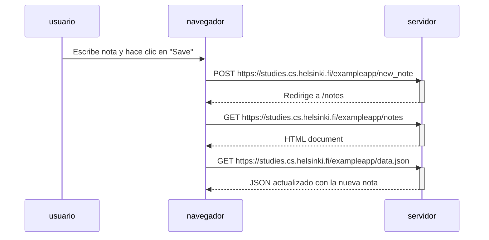
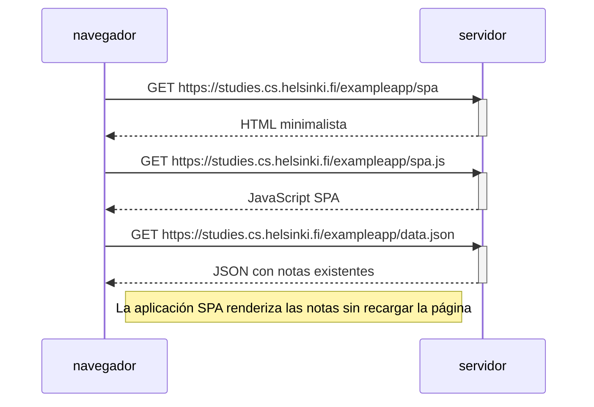
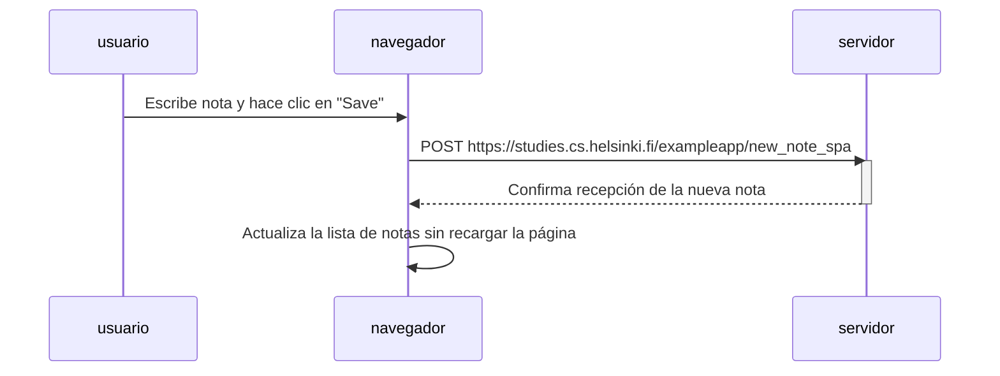

# Diagramas de la Aplicación de Notas

## 0.4: Creación de una nueva nota en la versión clásica

## 0.5: Carga de la aplicación en la versión SPA

## 0.6: Creación de una nueva nota en la versión SPA

